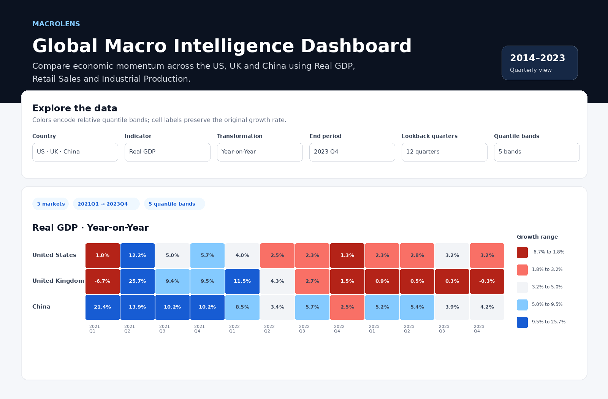
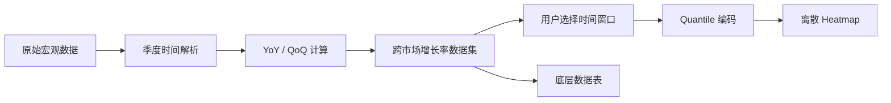
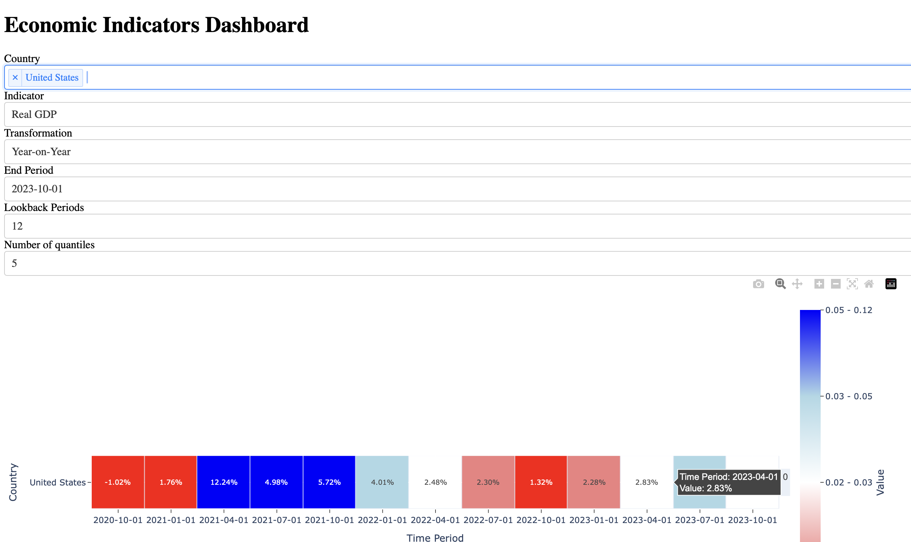

# MacroLens
### AI 协作全球宏观经济洞察 Dashboard

> 一个用于比较美国、英国、中国宏观经济动能的交互式 Dashboard，也是一份关于**人机协作、结果验证与产品判断**的项目案例。



**我的角色：** 产品定义 · 数据处理 · 数据分析 · 交互设计 · AI 协作与验证  
**技术栈：** Python · Pandas · NumPy · Dash · Plotly  
**AI 使用方式：** 将 ChatGPT 作为 coding / debugging / solution-exploration copilot，而不是直接接受生成结果  
**数据范围：** 3 个市场 × 3 类指标 × 44 个原始季度（2013 Q1–2023 Q4）；YoY 完整展示区间为 2014 Q1–2023 Q4

## 1. 项目背景

跨市场进行宏观判断时，GDP、零售销售、工业生产等数据往往分散在不同统计机构、不同数据结构与不同统计口径中。分析者如果逐个查看原始序列，很难快速比较不同国家在同一时期的经济动能变化。

我因此构建了 **MacroLens**，把美国、英国、中国的三类宏观指标整理为统一的季度增长率视图，并支持：

- GDP 相关指标
- 零售销售（Retail Sales）
- 工业生产（Industrial Production）
- 同比（YoY）/ 环比（QoQ）切换
- 国家、结束季度、回溯区间、分位区间数量的动态选择

需要特别说明：这里的“可比较”指的是**增长率视图和交互结构可比较**，并不意味着三个国家的原始统计口径完全一致。美国 GDP 来源是 FRED 的 Real GDP 系列，英国 GDP 来源是 ONS chained volume measures，而中国原始来源记录为 `Gross Domestic Product, Current Quarter (100 million yuan)`。因此本项目更适合用于观察**经济动能变化**，而不是直接比较三国绝对经济规模或声称统计定义完全同质。

## 2. 产品设计

Dashboard 的核心目标不是展示更多图，而是让用户更快回答两个问题：

1. **这个季度的增长率是多少？**
2. **这个数值在当前所选样本中处于什么相对位置？**

因此 heatmap 中的两个视觉通道被刻意分开：

- 单元格文字：展示原始增长率
- 单元格颜色：展示该观察值所属的 quantile band



## 3. AI 协作方式

这个项目的 AI 协作不是“一句话生成 Dashboard”，而是持续的 **提出需求 → 获得候选方案 → 实际运行 → 发现偏差 → 重新定义约束 → 继续迭代**。

我逐渐把这套方式总结为：

> **Define → Prompt → Validate → Diagnose → Iterate → Deliver**  
> 定义问题 → 提示 AI → 验证输出 → 定位偏差 → 迭代 → 交付

其中最典型的例子是 heatmap。我希望**格子显示原始增长率，但颜色只表达所属 quantile，同一区间必须完全同色**。开发过程中，我发现“图成功渲染”并不代表 visual encoding 已经满足需求，于是把验收标准明确为“同一个 bin 的格子必须同色”，再将颜色数据与展示数据拆开：

```python
z = quantile_bin_indices          # 决定颜色
text = original_growth_rate       # 单元格展示原始值
customdata = original_growth_rate # hover 展示原始值
```

类似的迭代还发生在日期类型、季度输入、Plotly API 兼容以及 horizontal scrollbar 上。AI 帮助我快速探索技术方案，而我负责判断 **expected behavior 与 actual behavior 是否一致**，并决定下一轮应该修改代码还是重新定义交互。

**AI 帮我加速的部分：** API 探索、实现草稿、debugging 假设、替代方案比较。  
**我负责的部分：** 问题定义、数据逻辑、交互需求、验收标准、实际验证和最终决策。

更完整的真实协作案例见：[AI 协作案例说明](docs/AI_COLLABORATION.md)。

## 4. 从 2024 Prototype 到 V2

<details>
<summary>查看 2024 原始 Dashboard 截图</summary>



</details>

| 2024 原始版本 | V2 作品集版本 |
|---|---|
| 使用固定 44 行的循环处理数据 | 使用 Pandas `pct_change` 进行向量化计算 |
| callback 内混合 string / Timestamp 转换 | 使用统一季度时间模型处理日期 |
| 多次重复修改 Plotly layout | 可复用的 visualization module |
| bin index 上仍呈现连续感的颜色 | 真正 stepwise 的离散 colorscale |
| App、数据变换、分析实验混在一起 | 拆分为 `src/`、`analysis/`、`docs/`、`tests/` |
| Forecast 与 Dashboard 同等展示 | Forecast 降级为 legacy exploratory experiment |
| 课程作业式 README | 面向招聘者的产品 + AI 协作 Case Study |

## 5. 项目结构

```text
MacroLens/
├── app.py
├── requirements.txt
├── assets/
│   ├── dashboard-overview.png
│   └── style.css
├── data/
│   ├── raw/
│   └── processed/economic_growth.csv
├── src/
│   ├── data_processing.py
│   └── visualization.py
├── analysis/
│   └── legacy_forecast_2025.py
├── docs/
│   ├── AI_COLLABORATION.md
│   ├── DATA_SOURCES.md
│   ├── INTERVIEW_NOTES.md
│   ├── TENCENT_APPLICATION_CN.md
│   └── GITHUB_PUBLISHING.md
├── reports/
│   ├── original-macro-analysis.pdf
│   └── original-data-source-links.pdf
└── tests/
```

## 6. 本地运行

推荐使用 Python 3.10+。

### macOS / Linux

```bash
git clone https://github.com/<your-username>/macrolens.git
cd macrolens
python3 -m venv .venv
source .venv/bin/activate
python3 -m pip install -r requirements.txt
python3 app.py
```

### Windows PowerShell

```powershell
git clone https://github.com/<your-username>/macrolens.git
cd macrolens
python -m venv .venv
.venv\Scripts\Activate.ps1
python -m pip install -r requirements.txt
python app.py
```

浏览器打开：`http://127.0.0.1:8050/`

如果 `data/processed/economic_growth.csv` 已存在，`app.py` 会直接读取；若不存在，则会从 `data/raw/` 自动重建。

## 7. 数据来源与方法边界

原始来源记录来自：

- 美国：Federal Reserve Economic Data（FRED）
- 英国：Office for National Statistics（ONS）
- 中国：国家统计局（National Bureau of Statistics of China）

具体 series / source link 见：[数据来源与口径说明](docs/DATA_SOURCES.md)。

为什么 Dashboard 从 2014 Q1 开始？因为 YoY 需要与四个季度前比较。仓库保留 2013 Q1–Q4 作为基期，因此第一组完整 YoY 结果从 2014 Q1 开始。

本项目是基于 2024 年原始作业重构的作品集，不是实时投资产品。原始来源记录并没有完整保存所有月度到季度的聚合步骤、季调选择等过程，因此 V2 不会把这些历史处理方式包装成“完全自动化、完全同口径”的 production pipeline。生产版本应重新从官方 API / 官方季度序列构建 ingestion layer，并增加 schema、单位、频率与 source-level validation。

原来的 2025 GDP Random Forest forecast 被保留在 `analysis/` 下作为历史探索。由于每个国家只有约 40 个可用季度观察值，它不会被包装成 production-grade forecasting model。

## 8. 如果继续迭代

下一版优先级会是：官方数据自动拉取、数据口径与 schema 自动校验、补充 time-series chart、支持 URL state 分享、部署在线 Demo，以及将测试纳入 CI。

项目中最重要的原则保持不变：

> **AI 可以提高探索和实现速度，但正确性仍取决于人是否定义了清晰的验收标准，并真正验证结果。**
